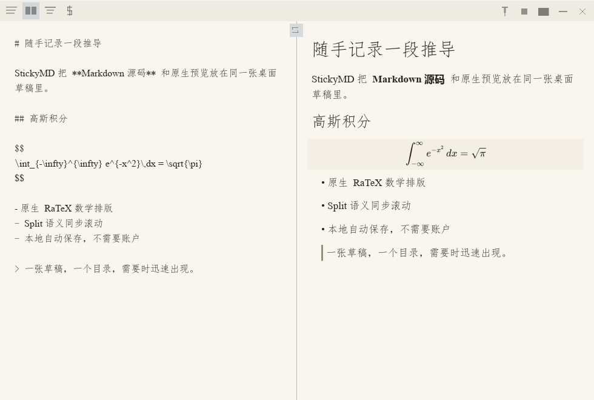

# StickyMD

> A Markdown scratchpad.

<p align="center">
  <a href="https://github.com/Develata/StickyMD/releases/latest"></a>
  <a href="https://github.com/Develata/StickyMD/actions/workflows/ci.yml"></a>
  <a href="LICENSE"></a>
  
</p>



StickyMD is a Windows 11 desktop application written in Rust. It opens ready to type, saves
automatically, renders Markdown and mathematics natively, and can hide against a screen edge until
you need it.

It is not a knowledge-management system or a general-purpose editor. StickyMD focuses on one job:
keeping a desktop Markdown scratchpad lightweight, reliable, and immediately available.

[Download](https://github.com/Develata/StickyMD/releases/latest) ·
[Release notes](docs/release-notes/0.1.0.md) ·
[中文](README.md) ·
[Report an issue](https://github.com/Develata/StickyMD/issues/new/choose)

<details>
<summary>Contents</summary>

- [Start in 30 seconds](#quick-start)
- [Good fits](#use-cases)
- [Highlights](#features)
- [Local data and privacy](#privacy)
- [Download and verification](#download)
- [Shortcuts](#shortcuts)
- [FAQ](#faq)
- [Deliberately narrow](#boundaries)
- [Contributing](#contributing)

</details>

<a id="quick-start"></a>

## Start in 30 seconds

1. Download `StickyMD-<version>-windows-x64-portable.zip` from
   [Releases](https://github.com/Develata/StickyMD/releases/latest).
2. Extract it to a writable directory such as `D:\Notes\MathScratch\`.
3. Run `StickyMD.exe` and start typing.
4. StickyMD maintains `note/note.md` beside the executable and autosaves about 650 ms after typing
   stops.

One directory is one note. Copy the entire StickyMD directory to create another independent
scratchpad.

### Optional: open StickyMD when you sign in to Windows

1. Create a shortcut to `StickyMD.exe`; on Windows 11, “Create shortcut” may be under “Show more
   options” in the context menu.
2. Press `Win+R`, enter `shell:startup`, and press Enter.
3. Move the shortcut into the Startup folder. StickyMD will open at the next Windows sign-in.

This is an optional Windows-managed shortcut; StickyMD does not register itself in the Registry or
create an autorun task. Recreate the shortcut after moving the program directory. Local Release
measurements put common steady views around 20 MB, making StickyMD suitable as a lightweight desktop
scratchpad; actual usage varies with the view, document, images, and Windows environment.

<a id="use-cases"></a>

## Good fits

- Writing temporary derivations, ideas, or fragments that include mathematics.
- Keeping a small Markdown scratchpad ready at a desktop edge.
- Editing source while seeing native Markdown and math output beside it.
- Maintaining separate portable scratchpads for research, teaching, or temporary work.

<a id="features"></a>

## Highlights

### Native mathematics

- Supports `$...$`, `$$...$$`, `\(...\)`, and `\[...\]` delimiters.
- Uses native RaTeX layout and painting, with no browser, JavaScript, or WebView.
- Covers common KaTeX-compatible fractions, roots, scripts, integrals, sums, matrices, and cases.
- Invalid formulas remain visible with an error indication; Markdown is never rewritten to hide an
  error.
- AI-generated mathematics often uses `\(...\)` / `\[...\]`. The `$` source action converts
  recognized formulas to Markdown-friendly `$...$` / `$$...$$` in one undoable edit, without
  touching code blocks or ordinary discussion text.

StickyMD supports **RaTeX/KaTeX-compatible math syntax**. It is not TeX Live or a full LaTeX
document compiler.

### Source, Preview, and Split

- Source edits the original Markdown.
- Preview renders CommonMark, GFM, tables, task lists, code, links, images, and math natively.
- Split is a fixed 50/50 view with semantic scroll alignment enabled by default and independently
  switchable.
- Preview selection uses the actual shaped text geometry; Raw HTML is displayed literally and is
  never executed.
- All three views share 50–300% content zoom.

### Fonts and mixed-script text

- Chinese/CJK text prefers `仿宋_GB2312`, then tries `FangSong_GB2312`, `仿宋`, `FangSong`, and
  `Microsoft YaHei`.
- Latin text prefers `Times New Roman`, then `Georgia`.
- If none of those families is available, the text engine selects an installed system fallback;
  code and mathematics use system monospace and RaTeX's embedded math fonts respectively.

Version 0.1.0 has no runtime font setting. For a custom source build, edit `CJK_CANDIDATES` and
`LATIN_CANDIDATES` in
[`crates/stickymd-render/src/source/fonts.rs`](crates/stickymd-render/src/source/fonts.rs), place the
installed Windows font family name first, and rebuild. `config.toml` cannot currently change fonts.

### Editing and desktop interaction

- Microsoft Pinyin and WeType composition are supported; one commit forms one undo operation.
- `Ctrl+F` opens literal Find and `Ctrl+H` expands Replace; case sensitivity is optional and regex
  is deliberately unsupported.
- Left, right, and top docking provide focus-loss auto-hide and 3-DIP edge reveal.
- IME composition and focused editing guard against auto-hide; pinning and auto-hide remain
  independent.
- Closing hides to the tray; the tray menu performs the real exit.


> The animation shows the top edge only; top, left, and right docking all support auto-hide and
> reveal.

### Portable manual multi-instance use

- Copy the entire StickyMD directory to create another independent scratchpad, then run instances
  from different directories together.
- Each directory owns its own `note/note.md`, configuration, images, and runtime state.
- The same canonical directory remains single-instance; launching it again wakes the existing
  window instead of allowing concurrent writes.

### Images, export, and reliable persistence

- Paste screenshots and PNG, JPEG, WebP, or GIF images; managed images use content hashes for
  naming and deduplication.
- Files placed manually in `note/images/` are never removed as managed assets.
- `Ctrl+Shift+S` exports Markdown and its referenced local images without switching the working
  note.
- Same-directory temporary files and atomic replacement protect saves; recovery and external-edit
  conflicts have explicit paths.

### Designed for low overhead

There is no browser runtime, database, network client, or general async runtime. Idle operation does
not redraw continuously, and undo, formula, and image caches have explicit bounds.

Across five independent local Release processes sampled after 30 idle seconds, median Private
Working Set was 12.98 MiB in Source, 15.50 MiB in Preview, and 20.89 MiB in Split; maxima were 13.03,
15.56, and 23.58 MiB, with idle CPU p95 between 0 and 0.0027%. These are reproducible local results,
not fixed guarantees for every machine; usage still varies with document, formula, image, and Windows
state. See the [Release memory attribution report](docs/report/phase-14-memory-attribution.md) for the
method and full data, and the
[performance and reliability contract](docs/plan/10_performance_reliability.md) for targets and hard
gates.

<a id="privacy"></a>

## Local data and privacy

```text
MathScratch/
├─ StickyMD.exe
└─ note/
   ├─ note.md
   ├─ config.toml
   ├─ images/
   └─ .trash/
```

- Notes and images stay in the current program directory.
- StickyMD writes neither AppData nor the Registry and requires no account.
- There is no cloud sync, telemetry, advertising, automatic updater, or runtime network request.
- Move or back up the whole directory to preserve the scratchpad.

<a id="download"></a>

## Download and verification

Requirements: **Windows 11 x64** and a normal directory writable by the current user. Do not place
StickyMD under `Program Files`; no administrator privileges are required.

The published portable ZIP has no identified dependency on Rust, Visual Studio, a C/C++ toolchain,
the Windows SDK, or a separate Visual C++ Redistributable. The Release build statically links the
MSVC CRT and passes ordinary and delay-load PE import checks. Version `v0.1.0` has not yet been
independently exercised in a clean Windows 11 VM; that disclosed qualification gap is distinct from
an external runtime requirement.

Version `v0.1.0` is not Authenticode-signed, so Windows may show a SmartScreen or reputation warning.
Do not disable Defender or SmartScreen. Download
[`SHA256SUMS.txt`](https://github.com/Develata/StickyMD/releases/latest/download/SHA256SUMS.txt) from
the same Release and compare it with:

```powershell
Get-FileHash .\StickyMD-0.1.0-windows-x64-portable.zip -Algorithm SHA256
```

See the [release notes](docs/release-notes/0.1.0.md) and [security policy](SECURITY.md) for details.

<a id="shortcuts"></a>

## Common shortcuts

| Shortcut | Action |
| --- | --- |
| `Ctrl+S` | Save immediately |
| `Ctrl+Z` / `Ctrl+Y` | Undo / redo |
| `Ctrl+F` | Open or close Find |
| `Ctrl+H` | Expand Find and Replace |
| `Ctrl++` / `Ctrl+-` / `Ctrl+0` | Zoom in / out / reset to 100% |
| `Ctrl+wheel` | Fine-grained content zoom |
| `Ctrl+Shift+S` | Export Markdown and referenced local images |
| `Esc` | Collapse a docked window |

`Ctrl+Insert`, `Shift+Delete`, and `Shift+Insert` also map to copy, cut, and paste.

<a id="faq"></a>

## FAQ

**Why does StickyMD edit only one `note.md`?**

“One directory, one scratchpad” is the product model. It removes file management UI and hidden
document state.

**How do I create another scratchpad?**

Copy the entire StickyMD directory. Different directories may run together; one directory allows
only one instance.

**How do I move or back up my note?**

Exit StickyMD and copy the whole directory. The `note/` folder contains the note, configuration, and
local images.

**Do users need Rust or Visual C++ installed?**

No. Those are source-build tools only. The clean-VM qualification gap is disclosed above.

**Why does Windows show SmartScreen?**

Version `v0.1.0` is not Authenticode-signed. Verify the official ZIP checksum instead of disabling
system protection.

**Does StickyMD support full LaTeX?**

No. It supports RaTeX/KaTeX-compatible mathematics, not packages, `\usepackage`, or a TeX executor.

<a id="boundaries"></a>

## Deliberately narrow

StickyMD does not provide file trees, tabs, vaults, backlinks, WYSIWYG editing, plugins, LSP, cloud
sync, accounts, AI features, analytics, remote-image downloads, or automatic updates.

Its narrow scope does not reduce correctness requirements for persistence, IME behavior, recovery,
bounded caches, or conflict handling.

<details>
<summary>Engineering, source builds, and verification</summary>

- Markdown semantics come from Comrak; math parsing and layout come from RaTeX.
- `DocumentState` is the sole runtime text authority; editor, Preview, and disk are projections or
  external facts.
- Platform-neutral crates forbid unsafe code; Win32 calls stay in approved adapters.
- The Rust `stickymd-smoke` CLI owns automated verdicts.

Building from source requires Windows 11 x64, MSVC C++/Windows SDK build tools, and the Rust toolchain
pinned by `rust-toolchain.toml`:

```powershell
cargo build --workspace --release --locked
./tools/smoke/all.ps1 -Ci
```

See [`docs/plan/`](docs/plan/) for the engineering contract and
[`docs/acceptance-cases/`](docs/acceptance-cases/) for acceptance contracts.

</details>

<a id="contributing"></a>

## Contributing

Accurate, reproducible bug reports are especially welcome. Pull requests are welcome too, but code
changes should begin with an Issue so scope and approach can be discussed before implementation.

- [Report a bug or propose an idea](https://github.com/Develata/StickyMD/issues/new/choose)
- [Contribution workflow](CONTRIBUTING.md)
- [Private security reports](SECURITY.md)
- [Product behavior](docs/features/00_v1_product_behavior.md)
- [Third-party notices](THIRD_PARTY_NOTICES.md)

## License

StickyMD is licensed under the [MIT License](LICENSE). Embedded KaTeX-compatible fonts retain the SIL
Open Font License 1.1; see [THIRD_PARTY_NOTICES.md](THIRD_PARTY_NOTICES.md).

## Community link

[LINUX DO](https://linux.do/) — thank you to the community for giving open-source projects a place
to exchange ideas and share their work. I have also learned a great deal from its discussions,
shared knowledge, and practical experience.
