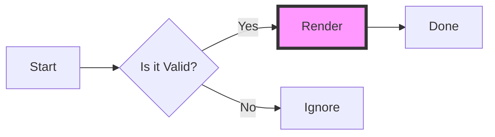
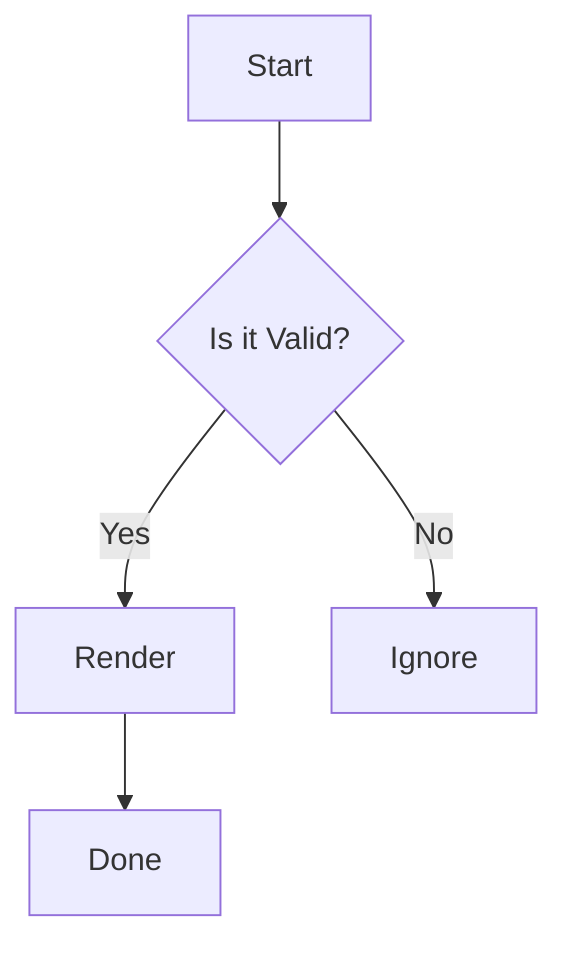

# 🧪 渲染引擎终极暴力测试 (Rendering Stress Test)


> [!CAUTION]
> **解析器警告**：本文本包含大量语法陷阱，用于测试 **Block/Inline 优先级**、**Math/Code 隔离** 以及 **混合排版** 的健壮性。StickyMD v1 将 Obsidian callout 标记按普通引用文字显示。

## 1. 优先级与隔离测试 (Priority & Isolation)

### 1.1 代码 vs 公式 (The Fortress of Code)
根据 StickyMD Markdown 契约，代码块拥有最高优先级。以下内容**不应**渲染为公式或标题：

```rust
// 这里的 $$ 不应触发 Block Math
fn calculate_danger() {
    let price = "$100"; // 这里的 $ 不应触发 Inline Math
    let formula = "E=mc^2";
    println!("Markdown keywords like **bold** or # Header should be ignored inside code.");
}

```

行内代码测试：

* `Code with $math$` -> 应显示原始字符 `$math$`。
* `Code with **bold**` -> 应显示原始字符 `**bold**`。
* `echo ` -> 反引号内包含空格。

### 1.2 公式 vs 样式 (The Math Container)

公式内部应保护 LaTeX 语法不被 Markdown 样式干扰：

* 普通公式：$E=mc^2$。
* 下划线陷阱：$x_{i_j}+y_{mathrm{long\_name}}$（不得被 Markdown 解释为斜体）。
* 星号陷阱：$a*b+c^{*}$（不得被 Markdown 解释为斜体）。
* 嵌套测试：**Bold Math: $\frac{a_i}{b_j}$**（外部加粗应生效，内部公式正常）。
* 转义测试：\$ Not a math $ (反斜杠转义应生效，显示普通 $ 符号)。

### 1.3 嵌套样式地狱 (Nested Styles)

* **Bold only**
* *Italic only*
* ***Bold and Italic***
* **Bold with *nested italic* inside**
* ~~Strikethrough with **bold** inside~~
* Link with style: **[Bold Link](https://example.com)**
* Auto Link: [https://develata.me](https://www.google.com/search?q=https://develata.me)

---

## 2. 块级元素压力测试 (Block Elements)

### 2.1 复杂列表 (Complex Lists)

1. 有序列表项 1
* 无序子项 A
* [ ] 任务列表：未完成
* [x] 任务列表：已完成 **(Bold)**


* 无序子项 B 包含公式：$\sum_{k=1}^{n} k=\frac{n(n+1)}{2}$


2. 有序列表项 2
> 引用嵌套在列表中
> ```js
> console.log("Code block inside quote inside list");
>
> ```
>
>


### 2.2 混合表格 (Hybrid Table)

表格中混合了代码、公式和样式：

| #   | 描述 (Description) | 渲染测试 (Render)   | 备注      |     |
| --- | ---------------- | --------------- | ------- | --- |
| 1   | **Inline Math**  | $\sqrt{x^2+y^2}$ | RaTeX   |     |
| 2   | **Inline Code**  | `rm -rf /`      | Danger  |     |
| 3   | **Escaped Pipe** | `a \| b`       | literal |     |
| 4   | **Mixed**        | ~~Delete~~ **$\alpha+\beta$** | Complex |     |

### 2.3 引用与标注 (Callouts/Admonitions)

> [!NOTE]
> 这是一个标准 Note。
> 支持多行文本；`[!NOTE]` 在 StickyMD v1 中只是普通引用内容。

> [!TIP]
> **嵌套测试**：
> > 内部引用
> >
>
>

---

## 3. 专业渲染能力 (Specialized Rendering)

### 3.1 块级公式 (Block Math)

应独占一行并居中渲染：

$$
f(x)=\begin{cases}
x^2, & x\ge 0 \\
-x, & x<0
\end{cases}
\qquad
A=\begin{pmatrix}a&b\\c&d\end{pmatrix}
$$

### 3.2 Mermaid 图表 (Diagrams)

StickyMD v1 不执行 Mermaid；以下内容必须保持为带 `mermaid` info string 的原始代码块，不能启动 JavaScript、SVG 或网络路径：





### 3.3 WikiLinks (内部链接)

StickyMD v1 不定义 WikiLink 方言；以下双括号必须作为普通文本保留：

* 标准链接：[[01_terminology]]
* 别名链接：[[02_positioning|项目定位篇]]

### 3.4 图片与远程资源边界

标题后的本地图片必须由 worker 解码，远程图片不得联网：


---

## 4. 边界与攻击测试 (Edge Cases & XSS)

* **HTML 注入**（必须以 literal code 风格显示，不执行、不构建 DOM）：
<div>Safe Block HTML</div>
<script>alert('XSS')</script> (Should be visible as text or sanitized)
* **长文本不换行**：
VeryLongWordWithoutSpaces_VeryLongWordWithoutSpaces_VeryLongWordWithoutSpaces_VeryLongWordWithoutSpaces_VeryLongWordWithoutSpaces
* **光标揭示 (Cursor Reveal) 预备区**：
（请尝试将光标移入下方链接或公式以测试源码展开）
[Hidden Link Syntax](http://example.com)

$$\mathcal{L}_{eff} = -\frac{1}{4} F_{\mu\nu}F^{\mu\nu} + \bar{\psi}(i\gamma^\mu D_\mu - m)\psi + \oint_{\partial \Sigma} \sqrt{-g} \left( \frac{R}{16\pi G} + \sum_{n=1}^{\infty} \frac{\zeta(2n)}{\pi^{2n}} \nabla^2 \phi^n \right) d^4x$$


$$\begin{aligned}
\dot{x} &= \sigma(y - x) \\
\dot{y} &= x(\rho - z) - y \\
\dot{z} &= xy - \beta z \\
f(n) &= \begin{cases}
\frac{n}{2} & \text{if } n \equiv 0 \pmod{2} \\
3n + 1 & \text{if } n \equiv 1 \pmod{2}
\end{cases}
\end{aligned}$$
$$\mathcal{Z}[J] = \int \mathcal{D}\phi \exp \left\{ \frac{i}{\hbar} \int d^4x \left[ \frac{1}{2} (\partial_\mu \phi)^2 - \frac{1}{2} m^2 \phi^2 - \frac{\lambda}{4!} \phi^4 + J(x)\phi(x) \right] \right\} \Bigg|_{J=0}$$
$$\begin{aligned}
R^\rho_{\ \sigma\mu\nu} &= \partial_\mu \Gamma^\rho_{\nu\sigma} - \partial_\nu \Gamma^\rho_{\mu\sigma} + \Gamma^\rho_{\mu\lambda}\Gamma^\lambda_{\nu\sigma} - \Gamma^\rho_{\nu\lambda}\Gamma^\lambda_{\mu\sigma} \\
\nabla_{[\lambda} R^\rho_{\ \sigma\mu\nu]} &= \frac{1}{3} (\nabla_\lambda R^\rho_{\ \sigma\mu\nu} + \nabla_\mu R^\rho_{\ \sigma\nu\lambda} + \nabla_\nu R^\rho_{\ \sigma\lambda\mu}) = 0 \\
G_{\mu\nu} + \Lambda g_{\mu\nu} &= \frac{8\pi G}{c^4} T_{\mu\nu}
\end{aligned}$$
$$\mathbf{M} = \begin{pmatrix}
\frac{\partial^2 f}{\partial x_1^2} & \frac{\partial^2 f}{\partial x_1 \partial x_2} & \cdots & \frac{\partial^2 f}{\partial x_1 \partial x_n} \\
\frac{\partial^2 f}{\partial x_2 \partial x_1} & \sum_{i=1}^k \frac{\sqrt{\lambda_i}}{\pi} & \cdots & \vdots \\
\vdots & \vdots & \ddots & \vdots \\
\frac{\partial^2 f}{\partial x_n \partial x_1} & \cdots & \cdots & \prod_{j=1}^m \left( 1 - \frac{z}{j^2\pi^2} \right)
\end{pmatrix}$$
$$I(x) = \sup_{\theta \in \mathbb{R}} \left\{ \theta x - \log \mathbb{E}[e^{\theta X_1}] \right\} \quad \text{s.t.} \quad \lim_{n \to \infty} \frac{1}{n} \log P(S_n \ge nx) = -I(x)$$

$$\mathbb{P} \left( \max_{1 \le i \le n} \frac{S_i}{i} \ge x \right) \le \exp \left( -n \inf_{\theta > 0} \underbrace{ \left\{ \theta x - \frac{1}{n} \sum_{j=1}^n \log \mathbb{E} \left[ e^{\theta X_j} \big| \mathcal{F}_{j-1} \right] \right\} }_{\text{Rate Function } I(x)} \right) \xrightarrow[n \to \infty]{\text{LDT}} 0$$
$$\left[
\begin{array}{c|c}
\displaystyle \sum_{k=0}^\infty \frac{\prod_{j=1}^k (a+j)}{k! \cdot z^k} & \sqrt{1 + \sqrt{1 + \sqrt{1 + x}}} \\
\hline
\begin{pmatrix} \alpha & \beta \\ \gamma & \delta \end{pmatrix}^{\dagger} & \int_{-\infty}^{\infty} e^{-x^2} \left( \frac{\partial^n}{\partial x^n} H_n(x) \right) dx
\end{array}
\right] \cong \text{Res}_{z=z_0} \left[ \frac{\Gamma(s) \zeta(s)}{z^s - 1} \right]$$


$$\begin{array}{ccccc}
A & \xrightarrow{f} & B & \xrightarrow{g} & C \\
\downarrow\phi & & \downarrow\psi & & \downarrow\omega \\
D & \xrightarrow{f'} & E & \xrightarrow{g'} & F
\end{array}$$

$$\begin{split}
\mathcal{Z}_n(\beta, \mu) = \int_{\Omega^n} \exp \left\{ - \beta \left[ \sum_{1 \le i < j \le n} V(|r_i - r_j|) + \sum_{k=1}^n \left( \frac{\mathbf{p}_k^2}{2m} + \Phi_{ext}(r_k) \right) \right] \right\} \prod_{l=1}^n \frac{d^3r_l d^3p_l}{h^3} \\
\times \left( \sum_{m=0}^\infty \frac{1}{m!} \left[ \int e^{\beta \mu} \left( \frac{\sqrt{2\pi mk_B T}}{h} \right)^3 \left( \prod_{a=1}^m \int_{\mathbb{R}^3} e^{-\frac{\beta}{2} \sum_{a \neq b} u(r_a, r_b)} dr_a \right) \right]^m \right) \\
\cong \exp \left( n \cdot \sup_{\rho \in \mathcal{P}(\Omega)} \left\{ \int_{\Omega} \rho(x) \log \frac{1}{\rho(x)} dx - \frac{\beta}{2} \iint_{\Omega^2} V(x-y) \rho(x) \rho(y) dx dy + \int_{\Omega} (\beta \mu - \beta \Phi_{ext}(x)) \rho(x) dx \right\} \right) \\
\text{where } \mathbf{T}_{\mu\nu} = \begin{pmatrix}
\frac{\partial \mathcal{L}}{\partial (\partial_\mu \phi)} \partial_\nu \phi - g_{\mu\nu} \mathcal{L} & \left( \frac{\sum_{i=1}^N \lambda_i}{\det | \mathbf{A} - \lambda \mathbf{I} |} \right) \\
\int_{0}^\infty \frac{x^{s-1}}{e^x - 1} dx & \prod_{p \text{ prime}} \left( 1 - \frac{1}{p^s} \right)^{-1}
\end{pmatrix}
\end{split}$$


$$\left[
\begin{array}{c|c}
\displaystyle \mathcal{F}_{\text{ext}} \left\{ \frac{\prod_{i=1}^\infty \Gamma(s_i)}{\sum_{j=1}^n \sqrt[k]{\frac{\partial^2 \phi}{\partial x_j^2}}} \right\} &
\begin{matrix}
\text{sup}_{k \ge 1} \left( \frac{\lambda_k}{\mu_k} \right) \\
\downarrow \\
\text{ess\,sup}_{t \in [0,T]} \| \dot{x}(t) \|_{\mathcal{H}}^2
\end{matrix} \\
\hline
\begin{cases}
\mathbb{E} \left[ \exp \left( \int_0^T \frac{\theta \cdot dW_t}{1 + \mathcal{R}(\rho_t)} \right) \right] & \text{if } \Delta > 0 \\
\oint_{\gamma} \frac{\mathcal{K}(z)}{(z-z_0)^{n+1}} dz = \frac{2\pi i}{n!} \mathcal{K}^{(n)}(z_0) & \text{if } \text{Sing}(f) \neq \emptyset \\
\left[ \sum_{m=1}^M \frac{\binom{N}{m}}{\sqrt{2\pi \sigma^2}} e^{-\frac{(m-\mu)^2}{2\sigma^2}} \right]^{-1} & \text{otherwise}
\end{cases} &
\underbrace{
\begin{pmatrix}
\frac{1}{1!} & \frac{1}{2!} & \cdots & \frac{1}{n!} \\
\frac{1}{2!} & \frac{1}{3!} & \cdots & \vdots \\
\vdots & \vdots & \ddots & \vdots \\
\frac{1}{n!} & \cdots & \cdots & \frac{1}{(2n-1)!}
\end{pmatrix}
}_{\text{Hilbert-like Matrix } \mathbf{H}_n}
\end{array}
\right] = \hat{\mathcal{L}}^{\dagger} \otimes \mathcal{M}$$
$$K(z) = \left( \frac{1}{1 + \frac{z}{1 + \frac{z^2}{1 + \frac{z^3}{1 + \frac{z^4}{1 + \dots}}}}} \right) + \sqrt[n]{x + \sqrt[n]{x + \sqrt[n]{x + \dots}}}$$
$$\left\langle \left. \bigoplus_{i=1}^\infty \bigcap_{j=1}^\infty \biguplus_{k \in \mathbb{R}} \right| \hat{\mathcal{H}} \left| \sum_{m \ne n} \prod_{p \text{ prime}} \int \dots \int_{\mathbb{R}^n} \right. \right\rangle_{ \! \! \! \! \! \! \! \! \! \! \! \! \text{chaos}}$$
$$\mathbf{\Xi} = \begin{pmatrix}
\begin{cases} \alpha & \text{if } x \in \mathbb{Q} \\ \beta & \text{if } x \in \mathbb{R} \setminus \mathbb{Q} \end{cases} & \xleftarrow{\text{mapping the space } \Omega} & \sum_{\substack{i < n \\ j < m \\ k < l}} \Psi_{i,j,k} \\
\hline
\text{Res} \left[ \frac{\Gamma(s)}{\zeta(s)} \right] & \sqrt{\frac{\int_0^\infty \frac{x^3}{e^x-1} dx}{\prod_{p} (1-p^{-2})}} & \left[ \begin{array}{ccc} a & b & c \\ d & e & f \\ g & h & i \end{array} \right]^{-1}
\end{pmatrix}$$
$$
\mathbb{G}_{n,p}^{\text{ER},\text{random}} \implies
\left\langle \psi \right| \hat{H} \left| \phi \right\rangle
= \int \Psi^* \mathcal{L} \Phi \, dx
$$
$$\begin{bmatrix}
\alpha & \beta & \gamma \\
\delta & \epsilon & \phi \\
\phantom{0} & \dots & \zeta
\end{bmatrix}
\underbrace{ \begin{array}{c} \text{Hidden Space} \\ \downarrow \\ \phantom{X^2 + Y^2 + Z^2} \end{array} }_{\text{This brace measures empty space}}$$
$$\frac{1}{2} + \left( \frac{\sum_{i=1}^n x_i}{\prod_{j=1}^m y_j} \right) \quad \text{vs} \quad \frac{1}{2} + \left( \frac{\textstyle \sum_{i=1}^n x_i}{\textstyle \prod_{j=1}^m y_j} \right)$$
$$
\frac{d^n y}{dx^n} + \sin\left(\frac{\pi}{2}\right)
= \left\langle \psi \right| \hat{H} \left| \phi \right\rangle
+ \left\lVert\vec{a}\times\vec{b}\right\rVert
$$
$$\frac{a \cancel{b}}{c \cancel{b}} + \cancel{X+Y} + Z$$
$$A \overset{\text{over}}{\longleftrightarrow} B \quad X \hookrightarrow Y$$
$$\text{Weierstrass p: } \wp \quad \text{Aleph: } \aleph_0 \quad \text{Beth: } \beth_1 \quad \text{Game: } \Game$$
$$
\left. \frac{\partial \mathcal{L}}{\partial \phi} \right|_{\cancel{\phi=0}}
\overset{\text{Gibbs Measure}}{\Rightarrow}
\left\langle \Psi \right| \hat{\mathcal{O}} \left| \Psi \right\rangle
+ \left[ \int_{-\infty}^{\infty} e^{-x^2} \, dx \right]^2
$$
$$\mathbb{P} \left( \bigcap_{v \in V(G)} \left\{ \left| \text{deg}(v) - (n-1)p \right| \ge \sqrt{3(n-1)p \log n} \right\} \right) \le \sum_{k=1}^n \binom{n}{k} \mathbb{E} \left[ \exp \left( \lambda \sum_{i=1}^k (X_i - \mathbb{E}X_i) \right) \right] \chi_{\{ \text{Conn}(G) \}}$$
$$\forall \mathscr{C} \in \text{Cat}_{\infty}, \quad \text{Map}_{\mathscr{C}}(x, y) \simeq \text{hocolim}_{n \in \Delta^{\text{op}}} \left( \underbrace{ \text{Res}_{\text{Sing}} \left| \coprod_{\alpha \in \mathcal{I}} \mathbb{B}G_\alpha \right| }_{\text{Topological Realization}} \right)^{\wedge}_p$$

$$
\begin{array}{ccc}
\mathbb N & \xrightarrow{S} & \mathbb N\\
\downarrow f && \downarrow f\\
X & \xrightarrow{T} & X
\end{array}
$$

---

## 5. 深滚动与懒加载终点

这一图片位于复杂表格、长代码、HTML literal 和大量公式之后，用于验证滚动到文档深处时仍会按
最新 viewport 请求图片 raster，而不是永久停留在占位骨架。


`STICKYMD_RENDERING_STRESS_END`
